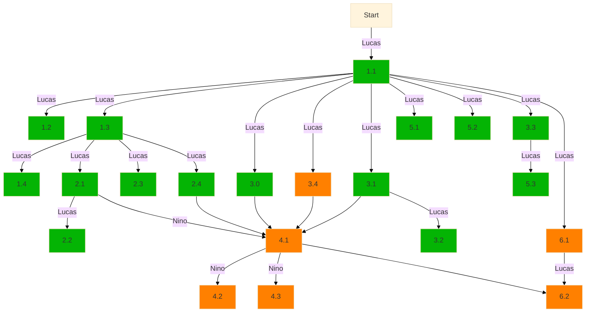

```mermaid

%%{init: {'theme':'base'}}%%
graph TD;

classDef done fill:#04B404;
classDef not_done fill:#FF8000;

    1.1:::done
    1.2:::done
    1.3:::done
    1.4:::done
    2.1:::done
    2.2:::done
    2.3:::done
    2.4:::done
    3.0:::done
    3.1:::done
    3.2:::done
    3.3:::done
    3.4:::not_done
    4.1:::not_done
    4.2:::not_done
    4.3:::not_done
    5.1:::done
    5.2:::done
    5.3:::done
    6.1:::not_done
    6.2:::not_done

    Start-->|Lucas|1.1;
    1.1-->|Lucas|1.2;
    1.1-->|Lucas|1.3;
    1.3-->|Lucas|1.4;
    1.3-->|Lucas|2.1;
    2.1-->|Lucas|2.2;
    2.1-->|Nino|4.1;
    1.3-->|Lucas|2.3;
    1.3-->|Lucas|2.4;
    2.4-->4.1;
    4.1-->|Nino|4.2;
    4.1-->|Nino|4.3;
    4.1-->6.2;
    1.1-->|Lucas|3.0;
    1.1-->|Lucas|3.4;
    3.4-->4.1;
    3.0-->4.1;
    1.1-->|Lucas|3.1;
    3.1-->4.1;
    3.1-->|Lucas|3.2;
    1.1-->|Lucas|5.1;
    1.1-->|Lucas|5.2;
    1.1-->|Lucas|3.3;
    3.3-->|Lucas|5.3;
    1.1-->|Lucas|6.1;
    6.1-->|Lucas|6.2;
```
